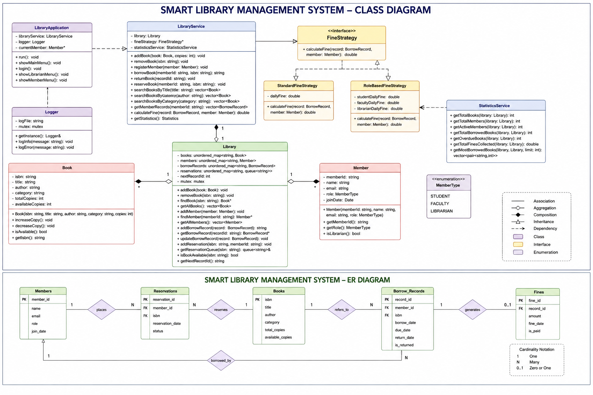

# Smart Library Management System

A C++17-based console application that simulates the core operations of a modern library management system, including book management, member management, borrowing, reservations, fines, role-based access control, statistics, logging, and automated testing.

---

## 1. Project Overview

The **Smart Library Management System** is an object-oriented C++ application developed using a layered architecture.

The system supports three types of library members:

* **Student**
* **Faculty**
* **Librarian**

### Key Features

* Book management
* Member management
* Role-based access control
* Student and faculty book borrowing
* Book returning
* Book reservation
* Borrowing history
* Fine calculation
* Role-based fine strategies
* Library statistics
* Exception handling
* Logging
* Interactive console-based user interface
* Unit testing
* Integration testing
* End-to-end testing
* CMake-based build system
* GoogleTest-based automated testing

The project separates the core library logic from the service layer, application layer, and testing layer to improve maintainability and modularity.

---

# 2. System Architecture

The project follows a layered architecture:

```text
+--------------------------------------------------+
|              Application Layer                   |
|              LibraryApplication                  |
+--------------------------------------------------+
                       |
                       v
+--------------------------------------------------+
|                 Service Layer                    |
|                 LibraryService                   |
|                StatisticsService                 |
+--------------------------------------------------+
                       |
                       v
+--------------------------------------------------+
|                  Domain Layer                    |
|      Library | Book | Member | BorrowRecord      |
+--------------------------------------------------+
                       |
                       v
+--------------------------------------------------+
|              Supporting Components               |
| FineStrategy | Exceptions | Logger | Statistics  |
+--------------------------------------------------+
                       |
                       v
+--------------------------------------------------+
|                  Test Layer                      |
|          GoogleTest Unit / Integration / E2E     |
+--------------------------------------------------+
```

---

# 3. Class Diagram

The following diagram represents the major classes, interfaces, relationships, and design patterns used in the project.


> **Note:** Copy `LMS Class Diagram.png` into the project's `docs/` directory using the structure shown below.

```text
Library_Management_System/
├── docs/
│   └── LMS Class Diagram.png
├── include/
├── src/
├── tests/
├── CMakeLists.txt
└── README.md
```

---

# 4. Folder Structure

```text
Library_Management_System/
│
├── include/
│   ├── Book.h
│   ├── Member.h
│   ├── BorrowRecord.h
│   ├── Library.h
│   ├── LibraryService.h
│   ├── LibraryException.h
│   ├── FineStrategy.h
│   ├── StandardFineStrategy.h
│   ├── RoleBasedFineStrategy.h
│   ├── StatisticsService.h
│   ├── LibraryApplication.h
│   ├── Logger.h
│   └── Other project headers
│
├── src/
│   ├── Book.cpp
│   ├── Member.cpp
│   ├── BorrowRecord.cpp
│   ├── Library.cpp
│   ├── LibraryService.cpp
│   ├── LibraryApplication.cpp
│   ├── StatisticsService.cpp
│   ├── Logger.cpp
│   ├── Fine strategy implementations
│   └── main.cpp
│
├── tests/
│   ├── Unit tests
│   ├── Integration tests
│   ├── EndToEndTest.cpp
│   └── Other GoogleTest files
│
├── docs/
│   └── LMS Class Diagram.png
│
├── build/
│   └── Generated CMake files and executables
│
├── CMakeLists.txt
└── README.md
```

### Directory Description

| Directory/File   | Purpose                                            |
| ---------------- | -------------------------------------------------- |
| `include/`       | Header files and class declarations                |
| `src/`           | C++ class implementations and application logic    |
| `tests/`         | GoogleTest unit, integration, and end-to-end tests |
| `docs/`          | Project documentation and diagrams                 |
| `build/`         | Generated build files and executables              |
| `CMakeLists.txt` | CMake build configuration                          |
| `README.md`      | Project documentation                              |

The `build/` directory is generated by CMake and should normally not be edited manually.

---

# 5. Technologies and Tools

## Operating System

* Windows

## Programming Language

* C++17

## Compiler

* MinGW-w64
* GCC 11.2.0

## Build System

* CMake
* GNU Make
* MinGW Makefiles

## Testing Framework

* GoogleTest (GTest)

## Development Environment

* Visual Studio Code

## Version Control

* Git
* GitHub

---

# 6. Design Concepts Used

The project demonstrates several important C++ and software engineering concepts.

### Object-Oriented Programming

The system uses:

* Classes
* Encapsulation
* Abstraction
* Composition
* Associations
* Interfaces
* Enumerations

### Layered Architecture

Responsibilities are separated between:

* Application layer
* Service layer
* Domain layer
* Supporting components
* Test layer

### Strategy Pattern

Fine calculation is implemented using the Strategy Pattern:

```text
             FineStrategy
                  |
        +---------+---------+
        |                   |
        v                   v
StandardFineStrategy   RoleBasedFineStrategy
```

This allows the fine calculation algorithm to be changed without modifying the main library logic.

### Role-Based Access Control

Different operations are permitted depending on the member role.

```text
Student
   |
   +-- Borrow
   +-- Return
   +-- Reserve
   +-- Search
   +-- View own records

Faculty
   |
   +-- Borrow
   +-- Return
   +-- Reserve
   +-- Search
   +-- View own records

Librarian
   |
   +-- Manage books
   +-- Manage members
   +-- View borrowing records
   +-- View statistics
```

### Exception Handling

The system uses custom exceptions for invalid operations, including:

* Invalid ISBN
* Book not found
* Member not found
* Unauthorized action
* Already returned book
* Invalid borrowing operations

---

# 7. Build Instructions

Open PowerShell in the project root directory.

## Step 1: Navigate to the Project

```powershell
cd "PATH\TO\Library_Management_System"
```

Replace the path with the actual location of the project.

## Step 2: Configure CMake

```powershell
cmake -S . -B build -G "MinGW Makefiles"
```

## Step 3: Build the Project

```powershell
cmake --build build
```

A successful build should finish without compilation or linking errors.

---

# 8. Running the Application

After a successful build:

```powershell
.\build\SmartLibraryApp.exe
```

The application starts the interactive Smart Library Management System.

The user is prompted to log in using a registered Member ID.

Example:

```text
========================================
       SMART LIBRARY MANAGEMENT SYSTEM
========================================

========================================
          SMART LIBRARY LOGIN
========================================

Enter Member ID:
```

---

# 9. Application Roles

## Librarian

The librarian can perform administrative operations such as:

* Add books
* Remove books
* Add members
* Remove members
* View all books
* View all members
* View borrowing records
* View library statistics
* Manage library resources

## Student

Students can:

* View available books
* Search books
* Borrow books
* Return books
* Reserve unavailable books
* View personal borrowing history
* View applicable fine information

## Faculty

Faculty members can:

* View available books
* Search books
* Borrow books
* Return books
* Reserve unavailable books
* View personal borrowing history
* View applicable fine information

---

# 10. Borrowing and Reservation Workflow

A typical borrowing workflow is:

```text
Login
  |
  v
Select Book
  |
  v
Check Availability
  |
  +---- Available ----> Borrow Book
  |
  +---- Unavailable ---> Reserve Book
                              |
                              v
                       Reservation Queue
                              |
                              v
                       Book Returned
                              |
                              v
                       Reservation Processed
```

Each borrowing operation creates a `BorrowRecord` containing information such as:

* Record ID
* Member ID
* Book ISBN
* Borrow date
* Due date
* Return date
* Return status

---

# 11. Fine Calculation

The system supports fine calculation through the `FineStrategy` interface.

Two strategies are implemented:

```text
FineStrategy
    |
    +-------------------------+
    |                         |
    v                         v
StandardFineStrategy    RoleBasedFineStrategy
```

The role-based strategy can calculate different fines according to the member's role.

Fine calculation is performed when an overdue book is returned.

---

# 12. Borrowing Records

Borrowing records are used to track library activity.

Each record contains:

```text
Record ID
Book ISBN
Member ID
Borrow Date
Due Date
Return Date
Returned Status
```

### Member View

Members can view their own borrowing records.

### Librarian View

The librarian can view borrowing records across the library, allowing the librarian to determine:

* Who borrowed a book
* Which book was borrowed
* When it was borrowed
* When it is due
* Whether it has been returned
* Whether a fine was generated

---

# 13. Statistics

The system provides library statistics through `StatisticsService`.

Statistics include information such as:

* Total books
* Total members
* Active members
* Total borrowed books
* Current overdue books
* Total fines collected
* Most borrowed books

Example output:

```text
========== LIBRARY STATISTICS ==========

Most Borrowed:
1. Clean Code          5 borrows
2. C++ Primer          3 borrows

Active Members:      3
Total Fines:         Rs.10
Overdue Books:       1

=========================================
```

---

# 14. Automated Testing

The project uses **GoogleTest** for automated testing.

The test suite covers:

* Individual class behavior
* Service-layer behavior
* Library workflows
* Exception handling
* Role-based authorization
* Borrowing
* Returning
* Reservations
* Fine calculation
* Statistics

---

# 15. End-to-End Test Coverage

The end-to-end test suite covers the major library workflows.

### 1. StudentCanBorrowBook

Verifies that a student can successfully borrow an available book.

### 2. FacultyCanBorrowBook

Verifies that a faculty member can successfully borrow an available book.

### 3. StudentCanReserveUnavailableBook

Verifies that a member can reserve a book when all copies are unavailable.

### 4. ReturningBookProcessesReservation

Verifies that returning a borrowed book processes the waiting reservation.

### 5. OverdueBookGeneratesFine

Verifies that an overdue borrowing record results in the expected fine.

### 6. StatisticsReflectLibraryActivity

Verifies that library statistics correctly reflect borrowing activity.

### 7. CompleteLibraryWorkflow

Verifies a complete workflow involving:

```text
Borrow
  ↓
Reserve
  ↓
Return
  ↓
Process Reservation
  ↓
Generate Statistics
```

### 8. UnauthorizedMemberCannotAddBook

Verifies that unauthorized members cannot perform librarian-only book management operations.

### 9. UnauthorizedMemberCannotRemoveBook

Verifies that unauthorized members cannot remove books.

### 10. InvalidOperationThrowsException

Verifies that invalid library operations generate the appropriate exceptions.

---

# 16. Running All Tests

To run all tests registered with CTest:

```powershell
ctest --test-dir build --output-on-failure
```

A successful CTest run normally reports:

```text
100% tests passed, 0 tests failed
```

---

# 17. Running End-to-End Tests Directly

The end-to-end test executable can also be executed directly:

```powershell
.\build\EndToEndTest.exe
```

GoogleTest displays the number of tests executed and their results.

A successful test appears as:

```text
[       OK ] EndToEndTest.StudentCanBorrowBook
```

A failed test appears as:

```text
[  FAILED  ] EndToEndTest.TestName
```

---

# 18. Running a Specific Test

A single test can be executed using the GoogleTest filter:

```powershell
.\build\EndToEndTest.exe --gtest_filter=EndToEndTest.OverdueBookGeneratesFine
```

This is useful when debugging a particular test without running the entire test suite.

---

# 19. Interpreting Build Results

A successful CMake build should complete without errors.

For example:

```text
[100%] Built target SmartLibraryApp
```

indicates that the application executable was successfully compiled and linked.

If compilation fails:

1. Read the first meaningful compiler error.
2. Check the referenced source file and line number.
3. Fix the source code.
4. Run:

```powershell
cmake --build build
```

---

# 20. Interpreting GoogleTest Results

A successful test:

```text
[       OK ] EndToEndTest.StudentCanBorrowBook
```

A failed test:

```text
[  FAILED  ] EndToEndTest.StudentCanBorrowBook
```

At the end of the test execution, GoogleTest displays a summary:

```text
[==========] 10 tests from 1 test suite ran.
[  PASSED  ] 10 tests.
```

The exact number displayed depends on the tests currently registered in the build.

If a test fails, examine the assertion or exception message printed immediately before:

```text
[  FAILED  ]
```

---

# 21. Troubleshooting

## CMake Generator Mismatch

If CMake reports a generator mismatch, remove the existing build directory:

```powershell
Remove-Item -Recurse -Force build
```

Then configure again:

```powershell
cmake -S . -B build -G "MinGW Makefiles"
```

Build:

```powershell
cmake --build build
```

## Compilation Failure

Run:

```powershell
cmake --build build
```

Then inspect the first compiler error.

## Test Failure

Run the failing test individually:

```powershell
.\build\EndToEndTest.exe --gtest_filter=TestSuite.TestName
```

Example:

```powershell
.\build\EndToEndTest.exe --gtest_filter=EndToEndTest.OverdueBookGeneratesFine
```

---

# 22. Project Status

The project currently contains:

* C++17 object-oriented implementation
* Layered application architecture
* CMake build system
* GoogleTest testing framework
* Unit testing
* Integration testing
* End-to-end testing
* Role-based access control
* Student, Faculty, and Librarian roles
* Book management
* Member management
* Borrowing workflow
* Returning workflow
* Reservation workflow
* Borrowing history
* Fine calculation
* Strategy Pattern
* Statistics
* Logging
* Custom exception handling
* Interactive console application

---

# 23. Project Documentation

Additional project documentation and diagrams are stored in:

```text
docs/
```
## Class Diagram



---

# 24. Conclusion

The **Smart Library Management System** demonstrates the development of a modular C++ application using object-oriented programming, layered architecture, design patterns, exception handling, CMake, and GoogleTest.

The application provides a complete interactive library workflow covering:

```text
User Login
    ↓
Role-Based Menu
    ↓
Book Search
    ↓
Borrow / Reserve
    ↓
Return
    ↓
Fine Calculation
    ↓
Borrowing History
    ↓
Library Statistics
```

The project can be configured and built using CMake, executed through the interactive console application, and validated using automated GoogleTest and CTest workflows.
